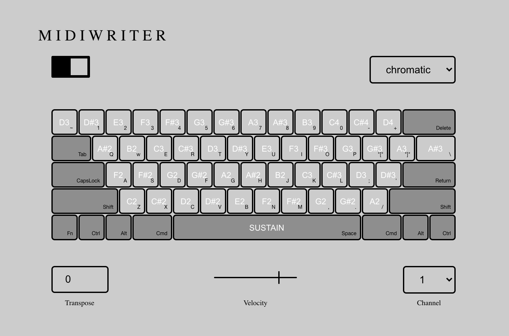

<div align="center">

# M I D I W R I T E R

**Turn your Macbook keyboard into a powerful MIDI Controller!**

[](https://opensource.org/licenses/MIT)
[](https://github.com/jidagraphy/midiwriter/releases)
[](https://github.com/jidagraphy/midiwriter)

<br />



</div>

---

## How to use
Most typical DAW has their own virtual MIDI input through computer keyboard, as a quick way to input notes - "A" to "L" would correspond to white keys and black keys above.

MIDIWRITER is a program that hijacks your keyboard input and simulates MIDI messages. The keys have a chromatic layout where each row offsets the notes every 5 notes, just like a guitar fretboard! This means a guitar player can easily adjust to the layout with minimal effort.

Download the installer in the [releases](https://github.com/jidagraphy/midiwriter/releases) page!

### 🛠️ Required Permissions (macOS)

> [!IMPORTANT]
> Since MIDIWRITER captures global keyboard events, you must grant it **Accessibility Permissions**:
> 1. Open **System Settings**.
> 2. Go to **Privacy & Security** > **Accessibility**.
> 3. Add **MIDIWRITER** to the list and ensure the toggle is **ON**.

## ✨ Features
- **Chromatic & Drumpad Layouts**: Toggle between a guitar-like layout or a standard launchpad-style drumpad.
- **macOS Tray Icon**: Quick access to toggle MIDI status, restore the main window, or quit the app.◊
- **Global Shortcut**: Press `Alt + Tab` to quickly toggle the MIDI capture on and off.
- **Dynamic Controls**: Adjust velocity, channel, and transpose on the fly.

## ⌨️ Manual scripts
```bash
npm install
npm run dev   # Development
npm run dist  # Build production app (.dmg)
```

## 📦 Dependencies
- Electron (Modern version)
- uiohook-napi (Native hardware hooks)

## 📮 Info

I won't have a focused time to work on this project and it already has a lot of bugs. Contact me for any inquiries!

**[@jidagraphy](https://github.com/jidagraphy)**

## License

[MIT](https://choosealicense.com/licenses/mit/)